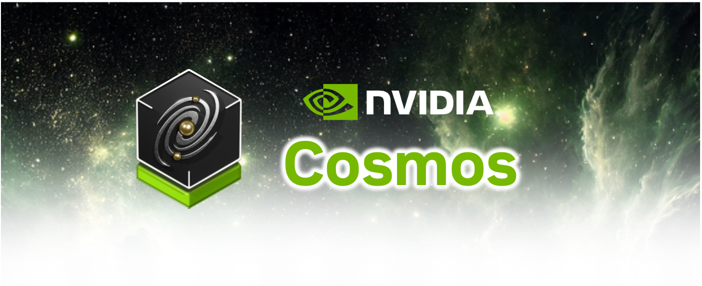

<p align="center">
    
</p>

### [Product Website](https://www.nvidia.com/en-us/ai/cosmos/)

# Cosmos-Curate

A powerful video curation system that processes, analyzes, and organizes video content using advanced AI models and distributed computing.

## Important

Please run `git submodule sync` if you have cloned the repository before and just pulled the latest update.
We updated the URL for `cosmos-xenna` submodule on 08/04/2025.

## Overview

Cosmos-Curate is a comprehensive solution for video processing and curation using state-of-the-art AI models,
which powers the training data generation for [Cosmos](https://www.nvidia.com/en-us/ai/cosmos/) at NVIDIA.
It is built on top of a framework optimized for GPU-accelerated streaming pipeline,
which is now open-sourced independently as [Cosmos-Xenna](https://github.com/nvidia-cosmos/cosmos-xenna).

## Features

- **Video Processing**: Efficient video splitting, annotation, filtering, deduplication, and dataset generation
- **AI-Powered Analysis**: Advanced video analysis using multiple model families
- **Distributed Computing**: Scalable processing using [Cosmos-Xenna](https://github.com/nvidia-cosmos/cosmos-xenna) built on top of [Ray](https://www.anyscale.com/product/open-source/ray)
- **Cloud Integration**: Support for various platforms
- **Pipeline System**: Modular and extensible pipeline architecture

## Documentation

Comprehensive documentation is available under [docs/](docs/README.md) directory.

### User Documentation
- [End User Guide](docs/client/END_USER_GUIDE.md) - For user to run video processing pipelines
- [Reference Video Pipelines Guide](docs/curator/REFERENCE_PIPELINES_VIDEO.md) - general video processing pipelines
- [Reference AV Pipelines Guide](docs/curator/REFERENCE_PIPELINES_AV.md) - multi-camera video, and (upcoming) GPS & LiDAR processing pipelines for autonomous vehicle (AV)

### Developer Documentation
- [Developer Guide](docs/DEVELOPER_GUIDE.md) - For contributors
- [Architecture Guide](docs/curator/ARCHITECTURE_GUIDE.md) - For developer to understand the core architecture
- [Pipeline Design Guide](docs/curator/PIPELINE_DESIGN_GUIDE.md) - For developer to add or modify pipelines

## Directory Structure

```bash
cosmos-curate/
├── cosmos_curate/         # Curate implementation
│   ├── client              # CLI to run locally
│       ├── image_cli       # Docker image management
│       ├── local_cli       # Launch pipelines by running local container
│       ├── nvcf_cli        # Launch pipelines on NVIDIA cloud function
│       ├── slurm_cli       # Launch pipelines on Slurm cluster
│       ├── utils           # Common utilities for various CLI apps
│   ├── core/               # Core functionality
│       ├── cf              # Service entry point for a cloud function deployment
│       ├── interfaces      # Core base class to integrate model and define new pipelines
│       ├── managers        # CLIs to run inside the container to manage models, databases, etc.
│       ├── utils           # Common utilities for pipelines
│   ├── models/             # AI model inference implementations
│   ├── pipelines/          # Pipeline implementations
│       ├── examples/       # Minimal example pipelines to help understand the framework
│       ├── video/          # Reference pipelines for video curation
│   ├── scripts/            # Startup scripts in various deployment environments
├── cosmos-xenna            # Git submodule for https://github.com/nvidia-cosmos/cosmos-xenna
├── packages                # Dockerfiles and scripts related to packaging
│   ├── cosmos_curate       # Dockerfile template and conda environment recipes for building cosmos_curate image
├── tests                   # Tests for testing
│   ├── cosmos_curate             
│       ├── pipelines       # Tests for models and pipeline stages for cosmos_curate
│       ├── client          # Tests for client CLIs
├── examples                # Example configuration files and scripts
```

Note: To initialize and update the `cosmos-xenna` submodule, run:
```
git submodule update --init --recursive
```
This ensures all submodule content is checked out correctly.

## Support

For support and questions:
- Check the [documentation](docs/README.md)
- Open an issue on GitHub

## Acknowledgments

- [cosmos-xenna](https://github.com/nvidia-cosmos/cosmos-xenna) team for the core library
- All contributors and users of the project

## Responsible Use of AI Models
[Responsible Use](./RESPONSIBLE_USE.md)

## License and Contact

This project will download and install additional third-party open source software projects. Review the license terms of these open source projects before use.

NVIDIA Cosmos source code is released under the [Apache 2 License](https://www.apache.org/licenses/LICENSE-2.0).

NVIDIA Cosmos models are released under the [NVIDIA Open Model License](https://www.nvidia.com/en-us/agreements/enterprise-software/nvidia-open-model-license). For a custom license, please contact [cosmos-license@nvidia.com](mailto:cosmos-license@nvidia.com).
