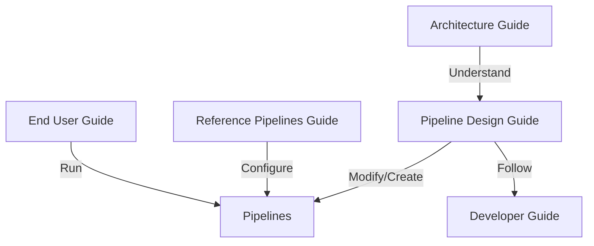

# Cosmos-Curate Documentation

- [Cosmos-Curate Documentation](#cosmos-curate-documentation)
  - [Documentation Structure](#documentation-structure)
    - [1. End User Guide and Reference Pipelines Guide for Video \& AV](#1-end-user-guide-and-reference-pipelines-guide-for-video--av)
    - [2. Architecture Guide and Pipeline Design Guide](#2-architecture-guide-and-pipeline-design-guide)
    - [3. Developer Guide](#3-developer-guide)
  - [Guide Relationships](#guide-relationships)
  - [Getting Started](#getting-started)
  - [Support](#support)
  - [Contributing to Documentation](#contributing-to-documentation)

Welcome to the Cosmos-Curate documentation. This documentation is organized into three main categories to help you understand and use the system effectively.

## Documentation Structure

### 1. [End User Guide](client/END_USER_GUIDE.md) and Reference Pipelines Guide for [Video](curator/REFERENCE_PIPELINES_VIDEO.md) & [AV](curator/REFERENCE_PIPELINES_AV.md)
The end user guide is designed for users who want to use the Cosmos-Curate to process and curate videos. It covers:
- Prerequisites and environment setup
- Basic usage instructions
- Running pipelines
- Troubleshooting common issues

**When to use this guide:**
- If you're new to Cosmos-Curate
- If you want to run existing pipelines
- If you need help with basic operations

### 2. [Architecture Guide](curator/ARCHITECTURE_GUIDE.md) and [Pipeline Design Guide](curator/PIPELINE_DESIGN_GUIDE.md)
The architecture and pipeline design guides are for developers who want to create new pipelines or modify existing ones. It covers:
- Core architecture
- Pipeline development
- New model integration
- Performance optimization guidelines

**When to use these guides:**
- If you're creating a new pipeline
- If you're modifying an existing pipeline
- If you need to understand the pipeline architecture

### 3. [Developer Guide](DEVELOPER_GUIDE.md)
The developer guide is for contributors who want to work on the Cosmos-Curate codebase. It covers:
- Development environment setup
- Code quality standards
- Testing procedures
- Contribution guidelines

**When to use this guide:**
- If you're setting up a development environment
- If you're contributing to the codebase
- If you need to understand the development workflow

## Guide Relationships

## Getting Started

1. **New Users**:
   - Start with the [End User Guide](client/END_USER_GUIDE.md) to learn how to use the system
   - Refer to the [Reference Video Pipelines Guide](curator/REFERENCE_PIPELINES_VIDEO.md) to explore the many options to configure the reference pipelines targeting general videos
   - Refer to the [Reference AV Pipelines Guide](curator/REFERENCE_PIPELINES_VIDEO.md) to explore the many options to configure the reference pipelines targeting autonomous vehicle
2. **Developers**:
   - Begin with the [Developer Guide](DEVELOPER_GUIDE.md) to set up your development environment
   - Read the [Architecture Guide](curator/ARCHITECTURE_GUIDE.md) to understand the big picture
   - Use the [Pipeline Design Guide](curator/PIPELINE_DESIGN_GUIDE.md) to modify existing pipelines or create new pipelines

## Support

If you need additional help:
- Review the examples and best practices
- Contact the development team

## Contributing to Documentation

If you find any issues or want to improve the documentation:
1. Follow the contribution guidelines in the [Developer Guide](curator/DEVELOPER_GUIDE.md)
2. Make sure your changes are consistent with the existing documentation style
3. Update all relevant guides if your changes affect multiple areas
