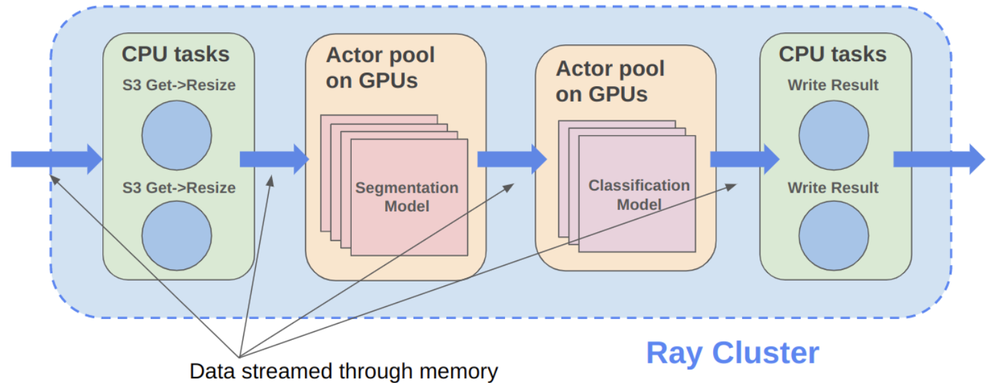
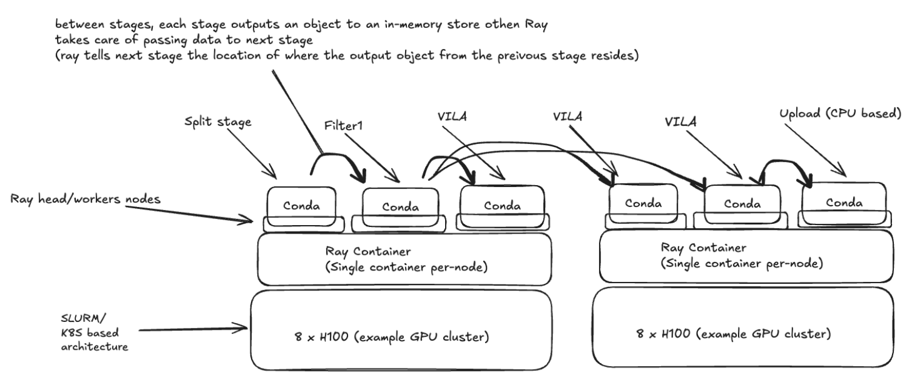

# Cosmos-Curate - Architecture Guide

- [Cosmos-Curate - Architecture Guide](#cosmos-curate---architecture-guide)
  - [Overview](#overview)
  - [Logical View](#logical-view)
  - [Physical View](#physical-view)
  - [Key Features](#key-features)
    - [How does stage worker hide data movement and deserialization latency?](#how-does-stage-worker-hide-data-movement-and-deserialization-latency)
    - [How does auto-scaling balance the pipeline stages?](#how-does-auto-scaling-balance-the-pipeline-stages)
    - [How to handle large variation in input data?](#how-to-handle-large-variation-in-input-data)
  - [Reference](#reference)

This guide explains the core architecture of the Cosmos-Curate framework.

## Overview

At a high level, the system works as follows:
- On startup, a pool for stage workers are created for each pipeline stage;
  - each stage worker is a [Ray actor](https://docs.ray.io/en/latest/ray-core/actors.html) which is essentially a stateful worker managed by Ray.
  - each stage performs some actions on the pipeline payload (also referred to as pipeline task), e.g. decode and extract N frames from a video. The result is typically saved back to the pipeline task object to be passed to the next stage.
  - all the stage workers from different stages should be active in a steady state, and many pipeline tasks stream through the pipeline.
- The main orchestration process runs in a tight loop that
  - feeds input tasks into the first stage and moves pipeline tasks completed by stage X to stage (X + 1);
  - monitors the aggregate throughput of each stage's pool of workers, and scales the worker pool size accordingly.

Regarding [Ray](https://www.anyscale.com/product/open-source/ray),
the framework leverages two key features of [Ray Core](https://docs.ray.io/en/latest/ray-core/walkthrough.html)
- Manage Ray actors across a Ray cluster with one or more nodes.
- Pass objects across a Ray cluster using Ray's [distributed object store](https://docs.ray.io/en/latest/ray-core/objects.html#objects-in-ray).

With that, [Cosmos-Xenna]((https://github.com/nvidia-cosmos/cosmos-xenna)) implements an orchestration layer to run data pipeline efficiently.

Before we dive into more details, it is helpful to understand the main motivation for the design:
- minimize IO/egress cost by running long pipelines with many stages
- minimize cluster storage requirement by streaming data through stages
- leverage heterogeneous resources efficiently, i.e. HGX servers typically have 200+ logical CPU cores for 8 GPUs

## Logical View

The diagram below illustrates a logical view of a 4-stage pipeline.
- Each stage has a pool of Ray actors as its stage workers, some are CPU-only and some use GPUs.
  - An important feature here is each Ray actor can run in specific conda environment. So if the `segmentation model` and `classification model` have dependency conflicts, they can use separate conda environments.
  - This makes adding new models to a pipeline much easier.
- Each actor works on a separate piece of data, e.g. one or a few videos.
  - This is essentially a data-parallel approach and therefore a stage's actor pool size represents the max throughput of that stage.
  - Then to maximize the overall throughput, intuitively the pipeline should (1) allocate all the resources to the actors and (2) scale the actor pool sizes such that the max throughput of all stages are roughly the same.
- Pipeline task objects are streamed through memory leveraging Ray's distributed object store.
  - So when the main orchestration process moves pipeline tasks from one stage to the next, it really moves the object reference, which is essentially a pointer, instead of the actual data.
  - It is the stage worker's responsibility to pull and deserialize the pipeline task from the object store given the object reference. This is why the orchestration can be done in a central process.

## Physical View

To support the logical view above, physically what happens is illustrated below.
- A single container is started per node (with e.g. 200 CPU cores & 8 GPUs) and joins the Ray cluster.
  - Each container includes multiple conda environments such that a model requiring a specific conda environment can run anywhere in the Ray cluster.
- Each stage creates a pool of Ray actors, each of them is a stateful worker process running one of the nodes.
  - When a stage worker processes a pipeline task, the output is put into Ray object store and an object reference is returned to the main ochestration process.
  - That object reference is scheduled to a worker from the next stage's pool.
  - When the next stage's worker pulls actual object, Ray tells its physical location, either on the local node or a remote node in the Ray cluster.

## Key Features

### How does stage worker hide data movement and deserialization latency?

Each stage worker essentially consists of a 3-stage mini-pipeline:
1. download-loop: downloads pipeline task from the scheduling queue (maintained by orchestration process) into internal task queue;
2. deserialize-loop: takes pipeline task from the task queue, which is a [Ray object reference](https://docs.ray.io/en/latest/ray-core/objects.html) at this point, calls `ray.get` to pull the data to local memory & deserialize it, and put into a deserialized queue.
3. process-loop: takes pipeline task from the deserialized queue and calls `process_data` on the pipeline task.

In this way, as long as mini-stage 2 is notably faster than mini-stage 3, the data movement and deserialization cost can be completely hidden.
To make sure that is the case, when the orchestration process schedules a pipeline tasks to a worker of next stage,
affinity is taken into account to prefer a worker on the same node.
Because on the same node, the data movement exercises the memory bandwidth, which is on the order of `500GB/s`,
while cross-node data movement goes through front-end network, whose bandwidth is typically around `12.5~25GB/s`.

### How does auto-scaling balance the pipeline stages?

As the main orchestration process moves pipeline tasks between stages,
it can measure the throughput of each stage worker and project the expected throughput when N workers are allocated to each stage.

Based on
- the relative throughput of each stage's worker, i.e. `# of tasks per actor per second` for each stage
- the resource request of each stage's worker, e.g. CPUs, GPUs, NVDECs, NVENCs
- the total resource of the Ray cluster

An auto-scaler works out an allocation plan to balance the throughputs of all stages such that overall throughput is maximized.

### How to handle large variation in input data?

The memory consumption and processing time for a video curation pipeline is very input data dependent.
Take the [split-annotate pipeline](./REFERENCE_PIPELINES_GUIDE.md#shard-dataset-pipeline) as an example,
the input video can be either 1-min long or 5-hour long.
plus the pipeline might only knows this after a video finishes the first `VideoDownloader` stage.

Then after splitting, the 1-min video may results in 5 clips while the 5-hour video may results in 1000 clips.
This poses a huge challenge for downstream stages.
For example, in the `ClipFrameExtraction` stage, if it tries to extract frames for all 1000 clips as a single pipeline task,
it is likely to cause system OOM.

To address that, the framework supports "dynamic chunking",
i.e. each pipeline stage can take X pipeline tasks as the input and output Y tasks.
So the task with that 5-hour video, when finishing up the `ClipTranscoding` stage,
the 1000 clips can be chunked into 63 16-clip tasks for downstream stages.

## Reference

Please refer to the tech blog for more illustrations: [Petabyte-Scale Video Processing with NVIDIA NeMo Curator on NVIDIA DGX Cloud](https://developer.nvidia.com/blog/petabyte-scale-video-processing-with-nvidia-nemo-curator-on-nvidia-dgx-cloud/).
