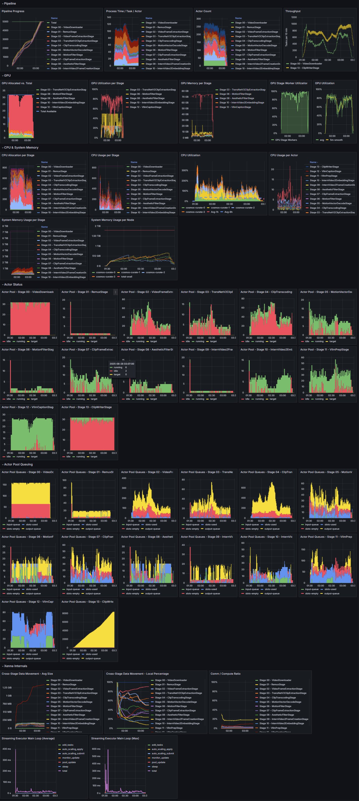

# Cosmos-Curate - Observability Guide

- [Cosmos-Curate - Observability Guide](#cosmos-curate---observability-guide)
  - [Performance Metrics](#performance-metrics)
  - [Grafana Dashboard](#grafana-dashboard)
  - [Deployment](#deployment)
    - [K8s-based Platforms](#k8s-based-platforms)
    - [Slurm Environment](#slurm-environment)

This guide walks through the metrics, monitoring dashboard, and deployment methods.

## Performance Metrics

[Prometheus](https://prometheus.io/)-compatible metrics are exported at port `localhost:9002/metrics`.

A list of useful [PromQL](https://prometheus.io/docs/prometheus/latest/querying/basics/) queries for performance debugging are summarized below:

```bash
# Measured stage speed, i.e. process time per task per actor for each stage
sum by (stage) (ray_pipeline_actor_process_time)

# Number of busy vs. idle workers per stage
sum by (stage, state) (ray_pipeline_actor_count{state!="target", state!="pending"})

# Input & output queue sizes per stage
sum by (stage) (ray_pipeline_input_queue_size)
sum by (stage) (ray_pipeline_output_queue_size)

# Cross-stage object size
(sum by (stage) (ray_pipeline_stage_deserialize_size_total))
/ on (stage) group_left ()
(sum by (stage) (ray_pipeline_stage_deserialize_count_total))

# Communication time / process time; i.e. are we able to hide cross-stage data movement
(sum by (stage) (ray_pipeline_stage_deserialize_time_total))
/ on (stage) group_left ()
(sum by (stage) (ray_pipeline_stage_process_time_total))

# GPU utilization averaged by stage
avg by (stage) (
    ray_pipeline_stage_gpu_alloc * on (SessionName, NodeAddress, GpuIndex) group_left
    label_replace(ray_node_gpus_utilization, "NodeAddress","$1","ip", "(.+)")
)

# GPU memory usage averaged by stage
avg by (stage) (
    ray_pipeline_stage_gpu_alloc * on (SessionName, NodeAddress, GpuIndex) group_left
    label_replace(ray_node_gram_used, "NodeAddress","$1","ip", "(.+)")
)

# CPU usage aggregated per stage
sum by (stage) (ray_pipeline_actor_resource_usage{stage!="", resource="cpu"}) / 100

# Average CPU usage per actor for each stage
(sum by (stage) (ray_pipeline_actor_resource_usage{stage!="", resource="cpu"}))
/ on (stage)
(sum by (stage) (ray_pipeline_actor_count{state="running"})) / 100

# System memory usage aggregated per stage
sum by (stage) (ray_pipeline_actor_resource_usage{stage!="", resource="memory"})
```

## Grafana Dashboard

An awesome monitoring dashboard is provided at [cosmos-curate-oss.json](../../examples/observability/grafana/cosmos-curate-oss.json).

The panels are organized in the following rows:
- `Pipeline`:
  - per-stage progress, average process time, actor count
- `GPU`
  - per-stage GPU allocation, utilization, and memory usage
  - overall GPU stage-worker utilization (whether auto-scaling is able to keep GPU stages always busy)
  - overall GPU utilization
- `CPU & System Memory`
  - per-stage aggregated CPU allocation & usage (identify CPU bottlenecks)
  - per-stage average per-actor CPU usage (whether the resource request is appropriate)
  - per-node CPU utilization
  - per-stage memory usage (identify which stage is the root cause for e.g. system OOM)
  - per-node memory usage
- `Actor Status`
  - per-stage idle-red / busy-green actors (whether GPU stages are starved)
- `Actor Pool Queuing`
  - per-stage input/output queue sizes, number of used/empty slots (identify which stage is the bottleneck)
- `Xenna Internals`
  - cross-stage data movement size (this goes through front-end CPU network and hence should not be too large)
  - timing of main loop of streaming executor (whether the main orchestration thread is the bottleneck)



## Deployment

### K8s-based Platforms

On K8s-based platforms, including [NVCF](https://docs.nvidia.com/cloud-functions/user-guide/latest/cloud-function/overview.html),
the [Helm chart](../../charts/cosmos-curate/README.md) provided includes a [Prometheus Agent](https://prometheus.io/blog/2021/11/16/agent/)
which can scrape the metrics endpoint and [remote-write](https://prometheus.io/docs/specs/prw/remote_write_spec/)
to a [Thanos-like](https://thanos.io/) endpoint.

The relevant configurable entries in the chart can be found in [values.yaml](../../charts/cosmos-curate/values.yaml):

```yaml
metrics:
  enabled: true
  remoteWrite:
    endpoint: ...
    certPath: ...
    keyPath: ...
```

Do note that current version of the Helm chart will need some tweaks to work on vanilla Kubernetes clusters.

### Slurm Environment

On Slurm, there is an option `--prometheus-service-discovery-path` to the `cosmos-curate slurm submit` command.

If you provide a valid path, which needs to be accessible from the compute nodes,
a service-discovery file named `prometheus_service_discovery_{slurm_job_id}.json` will be created under that path.
The file can tell [Prometheus](https://prometheus.io/) where to find the metrics endpoints and what external labels to attach.

```json
[
  {
    "labels": {
      "job": "ray",
      "slurm_job_user": "haowang",
      "slurm_job_id": "80305",
      "slurm_job_name": "hao-test"
    },
    "targets": [
      "pool0-0218:9002"
      "pool0-0219:9002"
      "pool0-0220:9002"
      "pool0-0221:9002"
    "targets": [
      "pool0-0218:9002",
      "pool0-0219:9002",
      "pool0-0220:9002",
      "pool0-0221:9002"
    ]
  }
]
```

Then you can configure the cluster's Prometheus with the [file-based service discovery approach](https://prometheus.io/docs/guides/file-sd/), like

```yaml
scrape_configs:
- job_name: 'cosmos-curate'
  file_sd_configs:
  - files:
    - '<the same path you passed in>/prometheus_service_discovery_*.json'
```
