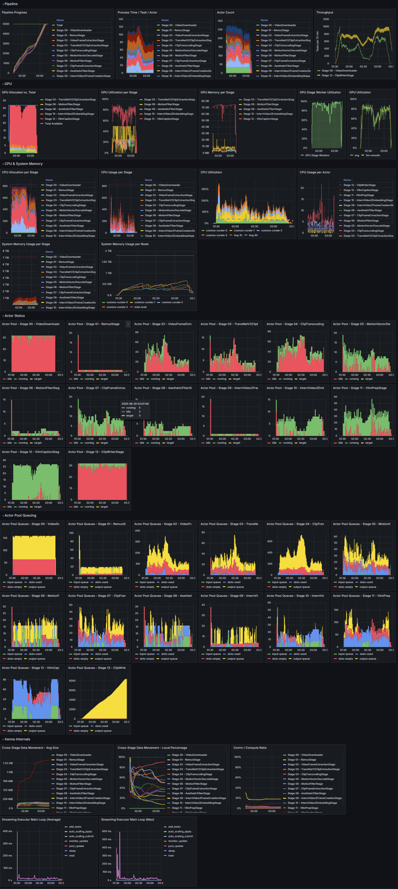

# Cosmos-Curate - Observability Guide

- [Cosmos-Curate - Observability Guide](#cosmos-curate---observability-guide)
  - [Profiling and Instrumentation](#profiling-and-instrumentation)
    - [CLI Flags](#cli-flags)
    - [CPU Profiling (pyinstrument)](#cpu-profiling-pyinstrument)
    - [Memory Profiling (memray)](#memory-profiling-memray)
    - [GPU Profiling (torch.profiler)](#gpu-profiling-torchprofiler)
    - [Distributed Tracing (OpenTelemetry)](#distributed-tracing-opentelemetry)
      - [Instrumenting Custom Stage Code](#instrumenting-custom-stage-code)
    - [Output and Post-processing](#output-and-post-processing)
  - [Performance Metrics](#performance-metrics)
  - [Grafana Dashboard](#grafana-dashboard)
  - [Deployment](#deployment)
    - [K8s-based Platforms](#k8s-based-platforms)
    - [Slurm Environment](#slurm-environment)

This guide walks through profiling, instrumentation, metrics, monitoring dashboard, and deployment methods.

## Profiling and Instrumentation

Cosmos-Curate provides automatic, framework-level profiling at three levels:

1. **Per-stage** -- injected transparently by `_build_pipeline_stage_specs()` in
   `pipeline_interface.py`.  Every stage's lifecycle methods (`stage_setup_on_node`,
   `stage_setup`, `process_data`) are automatically instrumented.
2. **Root / driver process** -- the `profiling_scope()` context manager in each
   pipeline's `run_pipeline.py` entry point wraps the entire pipeline execution,
   capturing work done outside of Ray actors (argument parsing, task construction,
   orchestration).
3. **Distributed tracing** -- OpenTelemetry spans via Ray's tracing hook, capturing
   cross-actor communication, scheduling delays, and the end-to-end distributed
   timeline across all processes.

A useful way to think about these tools:

- **Per-stage profiling** (pyinstrument, memray) = **microscope** -- deep view into
  one process (CPU call stacks, memory allocations within a single actor).
- **Distributed tracing** (OpenTelemetry) = **satellite view** -- shallow but wide
  perspective across all processes (which actor waited for which, where scheduling
  delays happened, end-to-end flow).

No changes to individual stage code are needed.

### CLI Flags

All profiling flags use purpose-based naming (`--profile-<what>`), not
implementation-based.

| Flag | Purpose | Backend | Status |
|---|---|---|---|
| `--perf-profile` | Lightweight per-task stats (wall-clock, idle, RSS, timestamps) | StageTimer | Available |
| `--profile-cpu` | CPU flame-tree profiling | pyinstrument | Available |
| `--profile-memory` | Heap memory allocation profiling | memray | Available |
| `--profile-gpu` | GPU kernel/operator profiling (CUDA) | torch.profiler | Available |
| `--profile-cpu-exclude <names>` | Comma-separated scopes to exclude from CPU profiling | pyinstrument | Available |
| `--profile-memory-exclude <names>` | Comma-separated scopes to exclude from memory profiling | memray | Available |
| `--profile-gpu-exclude <names>` | Comma-separated scopes to exclude from GPU profiling (default: `_root`) | torch.profiler | Available |
| `--profile-tracing` | Distributed cross-actor tracing (spans as NDJSON) | OpenTelemetry / Ray | Available |

All `--profile-*` flags imply `--perf-profile`.

Scope names used in `--profile-*-exclude` match stage class names
(e.g. `VideoDownloader`, `ClipWriterStage`) and the special name `_root` for the
driver process.  By default, `_root` is excluded from both GPU profiling
(the driver typically has no CUDA context) and memory profiling (memray
conflicts with pyinstrument's `sys.setprofile` hook on long-lived
processes).

### CPU Profiling (pyinstrument)

Wraps each stage's `stage_setup_on_node()`, `stage_setup()`, and
`process_data()` with a pyinstrument `Profiler` session.  The driver
process (`_root` scope) is also profiled when `--profile-cpu` is enabled.
Produces:

- **Per-call text summary** dumped to stdout for immediate visibility.
- **Per-call HTML flame-tree** and `.pyisession` file saved to `<output-path>/profile/cpu/`.

Example:

```bash
cosmos-curate local launch --curator-path . -- \
  pixi run python -m cosmos_curate.pipelines.video.run_pipeline split \
    --input-video-path /config/test_data/raw_videos/ \
    --output-clip-path /config/test_data/output_clips/ \
    --profile-cpu --verbose
```

### Memory Profiling (memray)

Wraps each stage's `stage_setup_on_node()`, `stage_setup()`, and
`process_data()` with a memray `Tracker`.
Produces:

- **Per-call stats summary** dumped to stdout (total allocations, peak memory, top allocation sites).
- **Per-call `.bin` capture** and **HTML flamegraph** saved to `<output-path>/profile/memory/`.

Example:

```bash
cosmos-curate local launch --curator-path . -- \
  pixi run python -m cosmos_curate.pipelines.video.run_pipeline split \
    --input-video-path /config/test_data/raw_videos/ \
    --output-clip-path /config/test_data/output_clips/ \
    --profile-memory --verbose
```

Both `--profile-cpu` and `--profile-memory` can be enabled simultaneously.
The driver process (`_root`) is excluded from memory profiling by default
to avoid the memray/pyinstrument `sys.setprofile` conflict:

```bash
cosmos-curate local launch --curator-path . -- \
  pixi run python -m cosmos_curate.pipelines.video.run_pipeline split \
    --input-video-path /config/test_data/raw_videos/ \
    --output-clip-path /config/test_data/output_clips/ \
    --profile-cpu --profile-memory --verbose
```

### GPU Profiling (torch.profiler)

Wraps each stage's `stage_setup_on_node()`, `stage_setup()`, and
`process_data()` with `torch.profiler.profile`.
Captures CUDA kernel launches, operator breakdown, GPU memory allocations,
and CPU-GPU synchronization.  Silently disabled on CPU-only workers or
when `torch` is not installed.
Produces:

- **Per-call key_averages table** dumped to stdout for immediate visibility.
- **Per-call Chrome Trace JSON** saved to `<output-path>/profile/gpu/`.

Example:

```bash
cosmos-curate local launch --curator-path . -- \
  pixi run python -m cosmos_curate.pipelines.video.run_pipeline split \
    --input-video-path /config/test_data/raw_videos/ \
    --output-clip-path /config/test_data/output_clips/ \
    --profile-gpu --verbose
```

### Distributed Tracing (OpenTelemetry)

Captures distributed spans across the entire pipeline via Ray's built-in
OpenTelemetry integration **plus application-level spans** from
`StageTimer` and `_ProfiledStage`.  Enable with `--profile-tracing`.

Three levels of spans are produced:

| Level | Source | What it captures |
|-------|--------|-----------------|
| **Ray spans** (automatic) | Ray OTel hook | Actor creation, method invocations, task scheduling |
| **Lifecycle spans** | `_ProfiledStage` | `setup_on_node`, `setup`, `process_data`, `destroy` |
| **Sample spans** | `StageTimer.time_process()` | Per-sample processing inside `process_data` |

Produces per-worker NDJSON span files under `<staging-dir>/traces/`
(collected post-pipeline by `ArtifactDelivery`) and optional live export
to an OTLP collector (Jaeger, Grafana Tempo, etc.).

```bash
cosmos-curate local launch --curator-path . -- \
  pixi run python -m cosmos_curate.pipelines.video.run_pipeline split \
    --input-video-path /config/test_data/raw_videos/ \
    --output-clip-path /config/test_data/output_clips/ \
    --profile-tracing --verbose
```

#### Instrumenting Custom Stage Code

The public tracing API lives in
`cosmos_curate/core/utils/infra/tracing.py`.  All functions are
**safe to call unconditionally** -- when tracing is not enabled
(`--profile-tracing` not passed), they become zero-cost no-ops.
No `if tracing_enabled` guards are needed.

**You do NOT need to call any setup function.**  Each pipeline's
`main()` wraps its execution in `profiling_scope(args)` -- the
top-level context manager that reads CLI flags and configures
all profiling and tracing infrastructure automatically:

```python
# run_pipeline.py (pipeline entry point)
def main() -> None:
    args = parse_args()
    with profiling_scope(args):   # <-- outermost wrapper, sets up everything
        args.func(args)
```

Stage code just imports and uses the public API -- no setup needed:

- **`--profile-tracing` passed**: spans are recorded and exported.
- **`--profile-tracing` NOT passed**: all API calls become
  zero-cost no-ops.  No overhead, no errors.

**Choosing the right API:**

| API | Creates new span? | When to use |
|-----|-------------------|-------------|
| `@traced(name)` | Yes (whole function) | Entire function body is one logical span; attributes known at decoration time |
| `traced_span(name)` | Yes (scoped block) | Span around a **subset** of a function, or attributes set **dynamically** |
| `TracedSpan.current()` | No (wraps existing) | Annotate a span created higher up (e.g. by `_ProfiledStage`) |

```
Decision tree:

    Whole function is one span?
          |               |
          v (yes)         v (no / partial)
    @traced(name)    traced_span(name)
                          |
    Need to annotate a parent span too?
          |
          v (yes)
    TracedSpan.current()
```

**Quick examples:**

Create spans at the **batch** or **phase** level, not per-item.
At scale (100 M+ items), per-item spans generate excessive trace
data.  Record per-item details as aggregated attributes instead.

```python
from cosmos_curate.core.utils.infra.tracing import (
    TracedSpan, traced, traced_span, StatusCode,
)

class MyStage(CuratorStage):

    # 1. @traced -- whole method is one span (static attributes)
    @traced("MyStage.load_model", attributes={"model.name": "resnet50"})
    def _load_model(self):
        self._model = load_weights("resnet50")

    def process_data(self, tasks):
        # 2. traced_span -- batch-level span, dynamic attributes
        with traced_span("MyStage.infer",
                         attributes={"stage.input_count": len(tasks)}) as span:
            results = [self._model(t.data) for t in tasks]
            span.set_attribute("stage.output_count", len(results))

        # 3. Error recording on caught exceptions (phase-level span)
        with traced_span("MyStage.download") as span:
            try:
                data = bulk_download([t.url for t in tasks])
                span.set_attribute("io.download_bytes", len(data))
            except TimeoutError as e:
                span.record_exception(e)
                span.set_status(StatusCode.ERROR, "Timeout")
                data = fallback_download(tasks)

        # 4. TracedSpan.current() -- annotate the parent span
        #    (created by _ProfiledStage, NOT by this code)
        TracedSpan.current().set_attribute("stage.total", len(tasks))
        return tasks
```

For the full deep-dive -- public span API (`TracedSpan`, `traced_span`,
`@traced`), Ray tracing hook internals, trace context propagation,
library auto-instrumentation, environment variables, and Jaeger setup --
see the **[Distributed Tracing Guide](DISTRIBUTED_TRACING_GUIDE.md)**.

### Output and Post-processing

All profiling artifacts are written to `<output-path>/profile/` with
subdirectories `cpu/`, `memory/`, `gpu/`, and `traces/`.  In multi-node
clusters, `ArtifactDelivery` collects artifacts from all nodes
post-pipeline and uploads them to the output path (local, S3, or Azure).

Quick reference for viewing results:

- **CPU**: Open `.html` in browser; merge with `benchmarks/merge_cpu_profiles.py`
- **Memory**: Open `.html` flamegraph; summarize with `benchmarks/merge_memory_profiles.py`
- **GPU**: Open `.json` in [Perfetto UI](https://ui.perfetto.dev/)
- **Traces**: Open `.jsonl` in [Perfetto UI](https://ui.perfetto.dev/)

For the full deep-dive -- backend internals, dynamic subclass architecture,
LIFO nesting, `profiling_scope` driver setup, file naming convention,
artifact delivery flow, profile merging scripts, and error handling --
see the **[Profiling Guide](PROFILING_GUIDE.md)**.

## Performance Metrics

[Prometheus](https://prometheus.io/)-compatible metrics are exported at port `localhost:9002/metrics`.

A list of useful [PromQL](https://prometheus.io/docs/prometheus/latest/querying/basics/) queries for performance debugging are summarized below:

```bash
# Measured stage speed, i.e. process time per task per actor for each stage
sum by (stage) (ray_pipeline_actor_process_time)

# Number of busy vs. idle workers per stage
sum by (stage, state) (ray_pipeline_actor_count{state!="target", state!="pending"})

# Input & output queue sizes per stage
sum by (stage) (ray_pipeline_input_queue_size)
sum by (stage) (ray_pipeline_output_queue_size)

# Cross-stage object size
(sum by (stage) (ray_pipeline_stage_deserialize_size_total))
/ on (stage) group_left ()
(sum by (stage) (ray_pipeline_stage_deserialize_count_total))

# Communication time / process time; i.e. are we able to hide cross-stage data movement
(sum by (stage) (ray_pipeline_stage_deserialize_time_total))
/ on (stage) group_left ()
(sum by (stage) (ray_pipeline_stage_process_time_total))

# GPU utilization averaged by stage
avg by (stage) (
    ray_pipeline_stage_gpu_alloc * on (SessionName, NodeAddress, GpuIndex) group_left
    label_replace(ray_node_gpus_utilization, "NodeAddress","$1","ip", "(.+)")
)

# GPU memory usage averaged by stage
avg by (stage) (
    ray_pipeline_stage_gpu_alloc * on (SessionName, NodeAddress, GpuIndex) group_left
    label_replace(ray_node_gram_used, "NodeAddress","$1","ip", "(.+)")
)

# CPU usage aggregated per stage
sum by (stage) (ray_pipeline_actor_resource_usage{stage!="", resource="cpu"}) / 100

# Average CPU usage per actor for each stage
(sum by (stage) (ray_pipeline_actor_resource_usage{stage!="", resource="cpu"}))
/ on (stage)
(sum by (stage) (ray_pipeline_actor_count{state="running"})) / 100

# System memory usage aggregated per stage
sum by (stage) (ray_pipeline_actor_resource_usage{stage!="", resource="memory"})
```

## Grafana Dashboard

An awesome monitoring dashboard is provided at [cosmos-curate-oss.json](../../examples/observability/grafana/cosmos-curate-oss.json).

The panels are organized in the following rows:
- `Pipeline`:
  - per-stage progress, average process time, actor count
- `GPU`
  - per-stage GPU allocation, utilization, and memory usage
  - overall GPU stage-worker utilization (whether auto-scaling is able to keep GPU stages always busy)
  - overall GPU utilization
- `CPU & System Memory`
  - per-stage aggregated CPU allocation & usage (identify CPU bottlenecks)
  - per-stage average per-actor CPU usage (whether the resource request is appropriate)
  - per-node CPU utilization
  - per-stage memory usage (identify which stage is the root cause for e.g. system OOM)
  - per-node memory usage
- `Actor Status`
  - per-stage idle-red / busy-green actors (whether GPU stages are starved)
- `Actor Pool Queuing`
  - per-stage input/output queue sizes, number of used/empty slots (identify which stage is the bottleneck)
- `Xenna Internals`
  - cross-stage data movement size (this goes through front-end CPU network and hence should not be too large)
  - timing of main loop of streaming executor (whether the main orchestration thread is the bottleneck)



## Deployment

### K8s-based Platforms

On K8s-based platforms, including [NVCF](https://docs.nvidia.com/cloud-functions/user-guide/latest/cloud-function/overview.html),
the [Helm chart](../../charts/cosmos-curate/README.md) provided includes a [Prometheus Agent](https://prometheus.io/blog/2021/11/16/agent/)
which can scrape the metrics endpoint and [remote-write](https://prometheus.io/docs/specs/prw/remote_write_spec/)
to a [Thanos-like](https://thanos.io/) endpoint.

The relevant configurable entries in the chart can be found in [values.yaml](../../charts/cosmos-curate/values.yaml):

```yaml
metrics:
  enabled: true
  remoteWrite:
    endpoint: ...
    certPath: ...
    keyPath: ...
```

Do note that current version of the Helm chart will need some tweaks to work on vanilla Kubernetes clusters.

### Slurm Environment

On Slurm, there is an option `--prometheus-service-discovery-path` to the `cosmos-curate slurm submit` command.

If you provide a valid path, which needs to be accessible from the compute nodes,
a service-discovery file named `prometheus_service_discovery_{slurm_job_id}.json` will be created under that path.
The file can tell [Prometheus](https://prometheus.io/) where to find the metrics endpoints and what external labels to attach.

```json
[
  {
    "labels": {
      "job": "ray",
      "slurm_job_user": "haowang",
      "slurm_job_id": "80305",
      "slurm_job_name": "hao-test"
    },
    "targets": [
      "pool0-0218:9002",
      "pool0-0219:9002",
      "pool0-0220:9002",
      "pool0-0221:9002"
    ]
  }
]
```

Then you can configure the cluster's Prometheus with the [file-based service discovery approach](https://prometheus.io/docs/guides/file-sd/), like

```yaml
scrape_configs:
- job_name: 'cosmos-curate'
  file_sd_configs:
  - files:
    - '<the same path you passed in>/prometheus_service_discovery_*.json'
```
