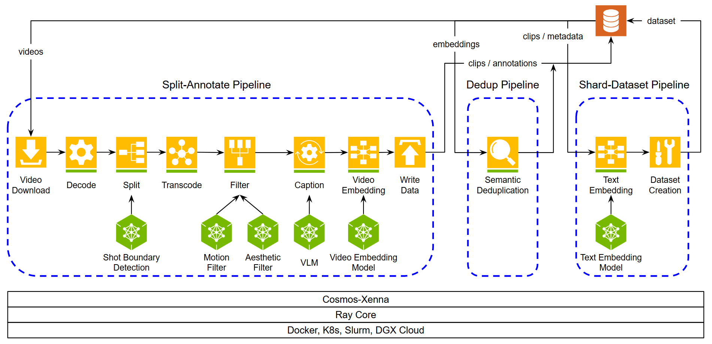

# Cosmos-Curate - Reference Video Pipelines

- [Cosmos-Curate - Reference Video Pipelines](#cosmos-curate---reference-video-pipelines)
  - [Split-Annotate Pipeline](#split-annotate-pipeline)
    - [Split-Annotate Pipeline Stages](#split-annotate-pipeline-stages)
    - [Split-Annotate Pipeline Output Format](#split-annotate-pipeline-output-format)
    - [Split-Annotate Pipeline Configurable Options](#split-annotate-pipeline-configurable-options)
  - [Shard-Dataset Pipeline](#shard-dataset-pipeline)
    - [Shard-Dataset Pipeline Stages](#shard-dataset-pipeline-stages)
    - [Shard-Dataset Pipeline Output Format](#shard-dataset-pipeline-output-format)
    - [Shard-Dataset Pipeline Configurable Options](#shard-dataset-pipeline-configurable-options)

Today two video pipelines are included as reference video pipelines:
- **Split-annotate pipeline** that can generate
  - clips and captions for training text-to-video and vision-language models;
  - video embeddings for semantic search and deduplication across the dataset;
  - various metadata for video analytics.
- **Shard-dataset pipeline** that can generate
  - ready-to-train `webdataset` for Cosmos fine-tunning from the output of split-annotate pipeline.

One work-in-progress pipeline is also included:
- **Dedup pipeline** that can performance deduplication based on video embeddings generated from `split-annotate pipeline`.
  - More details on this pipeline will be added soon.

The overall workflow is described in the diagram below:



## Split-Annotate Pipeline

### Split-Annotate Pipeline Stages

The split-annotate pipeline includes the following logical stages:
- **Video Download**: Downloads the videos from cloud storage or reads them from disk into memory.
- **Decoding and Splitting**: Decodes the video frames from the raw mp4 bytes and runs a TransNetV2-based splitting algorithm to split the video into clips based on shot transition.
- **Transcoding**: Encodes each of the clips into individual mp4 files under the same encoding (H264).
- **Filtering**: Filters out clips based on motion and aesthetics.
- **Video Embedding**: Creates an embedding for each clip, which can be used for constructing visual semantic search and/or performing semantic deduplication across dataset.
- **Captioning**: Generates a text caption of the clip using a vision-language model (VLM).
- **Clip Writer**: Uploads the clips and their metadata back to cloud storage or writes them to local disk.

Note above lists the "logical" stages from a functionality perspective,
"physically" we would break certain logical stage into multiple stages to optimize GPU utilization and system throughput.
For example, VLM captioning typically requires non-trivial preprocessing of the video, which is typically done on CPU and can hurt GPU utilization.
To improve upon that, the preprocessing functionality is separated into a VLM input preparation stage, such that
- the VLM input preparation stage can scale independently and spawn many parallel CPU workers to keep the captioning stage's GPU workers busy;
- the VLM captioning stage is left with mostly GPU work and therefore can achieve high GPU utilization and throughput.

### Split-Annotate Pipeline Output Format

Today the split-annotate pipeline produces the following artifacts under the path specified by `--output-clip-path`:

```bash
{output_clip_path}/
├── clips/
│   ├── {clip-uuid}.mp4             # transcoded clips
├── iv2_embd/
│   ├── {clip-uuid}.pickle          # InternVideo2 embedding per clip
├── ce1_embd/
│   ├── {clip-uuid}.pickle          # Cosmos-Embed1 embedding per clip
├── metas/v0/
│   ├── {clip-uuid}.json            # metadata per clip, motion & aesthetic scores will be included if enabled
├── previews/
│   ├── {clip-uuid}.webp            # web previews for each caption window if enabled
├── processed_videos/
│   ├── {input-video-relpath}.json  # record for each processed input videos
├── v0/all_window_captions.json     # aggregattion of all the captions generated for all the clips
├── summary.json                    # summary of the pipeline results
```

### Split-Annotate Pipeline Configurable Options

Below is a summary of the important options for the split-annotate pipeline. There are many more options available and can be seen from the help message:

```bash
cosmos-curate local launch \
    --image-name cosmos-curate --image-tag 1.0.0 --curator-path . \
    -- python3 -m cosmos_curate.pipelines.video.run_pipeline split --help
```

**Options for Input/Output**

- `--input-video-path`: path on local disk or `s3://` bucket that contains MP4 videos.
- `--input-presigned-s3-url`: presigned **HTTPS** URL that points to a ZIP file on S3. Cosmos-Curate will download, extract, and treat the extracted directory as `input_video_path`. Use this when you cannot expose the entire bucket but can issue a single presigned URL.
- `--output-clip-path`: destination directory (local or `s3://`) for individual clip files and metadata.
- `--output-presigned-s3-url`: presigned **HTTPS** URL where Cosmos-Curate will upload a single ZIP archive of everything it wrote to `output_clip_path`. Useful for one-shot batch jobs where the caller only needs one file to download.

Using presigned URLs embeds all necessary authentication in the link itself, so the pipeline **does not need AWS credentials configured** when these flags are used.

With `--input-video-path` above, by default it will find all files under that path.
In case there are too many files under the same path, you can also provide a specific list of videos in a json file in list format like bellow:

```json
[
    "s3://input-data/video1.mp4",
    "s3://input-data/video2.mp4",
    "s3://input-data/video3.mp4"
]
```

Then this json can be passed in with
- `--input-video-list-json-path`: specifies the path to a json file which contains a list of input videos; same as paths above, this can be either a path inside the container or on cloud storage.

In case you want the output to be in a different S3 bucket than the input, you can put multiple profiles in your `~/.aws/credentials` and use the following options:
- `--input-s3-profile-name`: profile name for `input_video_path`;
- `--output-s3-profile-name`: profile name for `output_clip_path`;
- `--input-video-list-s3-profile-name`: profile name for `input_video_list_json_path`.

**Options for Functionality**

- `--limit`: how many videos to process
- `--no-generate-embeddings`: disable InterVideo2/Cosmos-Embed1 embedding generation; use `"generate_embeddings": false` in API endpoint.
- `--embedding-algorithm`: specifies embedding model, available options are `cosmos-embed1` (default) and `internvideo2`.
- `--no-generate-captions`: disable VLM captioning; use `"generate_captions": false` in API endpoint.
- `--generate-previews`: enable web preview generation.
- `--splitting-algorithm`: specifies video-to-clip splitting algorithm, available options are `transnetv2` (default) and `fixed-stride`.
- `--motion-filter`: specifies the working mode for motion filter, available options are `disable` (default), `enable`, `score-only` (generate score but do not filter out clips).
- `--motion-global-mean-threshold`: specifies the empirical threshold for global average motion magnitude.
- `--motion-per-patch-min-256-threshold`: specifies the empirical threshold for minimal averge motion magnitude in any 256x256 patch.
- `--aesthetic-threshold`: specifies threshold for aesthetic filter, defaults to `None` which disables the filter; use a negative value like `-1` to achieve the "score-only" behavior.
- `--captioning-window-size`: specifies the captioning window size, defaults to 256 frames.

**Options for Performance**

- `--transnetv2-gpus-per-worker`: specifies number of fractional GPUs per work for `TransNetV2` stage; default to `0.25` targeting 48GB GPU.
- `--motion-score-gpus-per-worker`: same as above for `MotionFilter` stage; default to `0.5` targeting 48GB GPU.
- `--aesthetic-gpus-per-worker`: same as above for `AestheticFilter` stage; default to `0.25` targeting 48GB GPU.
- `--iv2-gpus-per-worker`: same as above for `InterVideo2Embedding` stage; default to `0.25` targeting 48GB GPU.
- `--qwen-batch-size`: specifies batch size for VLM captioning call.
- `--qwen-use-fp8-weights`: specifies whether to enable FP8 quantization.

## Shard-Dataset Pipeline

The shard-dataset pipeline takes the `output_clip_path` of split-annotate pipeline as its `input_clip_path` and generates a webdataset.

### Shard-Dataset Pipeline Stages

The shard-dataset pipeline has the following stages:
- **Text Embedding**: Creates a T5 embedding for each caption text.
- **Sharding**: Shards the data into a format that can be used to train/fine-tune a video foundation model.

### Shard-Dataset Pipeline Output Format

Today the shard-dataset pipeline produces the following artifacts under the path specified by `--output-dataset-path`:

```bash
{output_dataset_path}/
├── v0/
│   ├── resolution_720/                     # all clips at 720p resolution
│       ├── aspect_ratio_16_9/              # all clips at 16:9 aspect ratio
│           ├── frames_0_255/               # all captioning windows within frames 0 to 255
│               ├── metas/                  # tar-ed .json files containing metadata for each clip
│                   ├── part_000000/
│                       ├── 000000.tar
│                       ├── 000001.tar
│               ├── t5_xxl/                 # tar-ed .pickle files for text embedding of each caption
│                   ├── part_000000/
│                       ├── 000000.tar
│                       ├── 000001.tar
│               ├── video/                  # tar-ed .mp4 files for each clip
│                   ├── part_000000/
│                       ├── 000000.tar
│                       ├── 000001.tar
│           ├── frames_256_511/             # all captioning window within frames 256 to 511
│               ├── metas/
│                   ├── part_000000/
│                       ├── 000000.tar
│               ├── t5_xxl/
│                   ├── part_000000/
│                       ├── 000000.tar
│               ├── video/
│                   ├── part_000000/
│                       ├── 000000.tar
```

### Shard-Dataset Pipeline Configurable Options

Below are a few key options for shard-dataset pipeline:
- `--input-clip-path`: specifies the path inside the container or on cloud storage that holds all all the clips, captions, and metadatas. If you need to use a local path, the directory `~/cosmos_curate_local_workspace/` is mounted to `/config/`.
- `--output-dataset-path`: specifies where the output dataset will be stored.It functions similarly to `--input-clip-path` in terms of mounts.
- `--annotation-version`: specifies the annotation version to use for the clip metadata. This helps in scenarios where another process updates the clip metadata (e.g., captions) to a newer version (e.g., `v1`) after the splitting pipeline produced version `v0`.

An example command is as follows assuming you have not update the clip metadata to a new version:

```bash
cosmos-curate local launch \
    --image-name cosmos-curate --image-tag 1.0.0 --curator-path . \
    -- python3 -m cosmos_curate.pipelines.video.run_pipeline shard --help
    --input-clip-path <local or s3 path to store clips and metadatas produced by split-annotate pipeline> \
    --output-dataset-path <local or s3 path to store output dataset> \
    --annotation-version v0
```

Again, a full list of options can be seen from the help message

```bash
cosmos-curate local launch \
    --image-name cosmos-curate --image-tag 1.0.0 --curator-path . \
    -- python3 -m cosmos_curate.pipelines.video.run_pipeline shard --help
```
