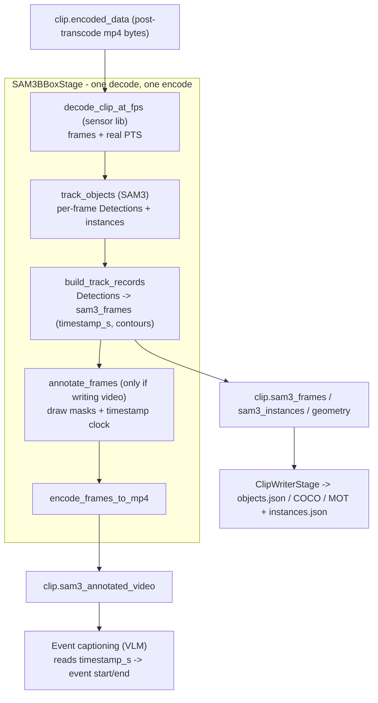

# Object Tracking and Video Transformation Design

## Scope

This document is the design for object tracking and the video annotation that builds on
it, in the video splitting pipeline
([cosmos_curator/pipelines/video/splitting_pipeline.py](../../../cosmos_curator/pipelines/video/splitting_pipeline.py)).

It covers:

- Why tracking, drawing, and encoding live in a single fused stage, composed from small
  stateless functions, so the clip is decoded once and encoded once.
- How per-frame time is derived once, from real presentation timestamps via the
  [sensor library](sensor-library.md), instead of being recomputed from frame counts.
- The stateless-function contracts inside the stage and the track-data structure they
  produce.

## Motivation: one decode, one encode; composable functions

A clip is expensive to touch: every decode and every encode is lossy and CPU-heavy, and
in a Ray pipeline the raw decoded frames (`frames * H * W * 3` bytes) are far larger than
the encoded mp4, so handing them between stages is its own cost. An earlier iteration
split the work into separate `track` / `text-burn-in` / `mask` stages so they could be
re-ordered; but each stage then had to decode → draw → encode independently, which on the
annotated path meant several decode/encode round-trips per clip and large inter-stage
buffer copies. There is no current pipeline that re-orders those steps, so that cost
bought nothing.

So the work is **one fused stage** that decodes once, runs SAM3, serializes the track
data, optionally renders the annotated video, and encodes once. Composability comes not
from chaining stages but from the stage being a thin *data router* over small
**stateless functions** with clean contracts (decode / track / serialize / annotate /
encode). Necessary copies stay inside the stage as in-process memcpys; nothing large
crosses a Ray boundary. If a future use case needs a different wiring — e.g. an
annotate-only stage that loads track data already on disk — it is a new thin stage that
re-wires the same functions, not a fork of a monolith.

A stage is defined by its *mechanism*, not its model: tracking uses SAM3 as the first
pluggable backend; event captioning is a separate stage that selects a model by config.
New trackers/models that fit a mechanism are a new backend + knobs, not a new stage.

## Architecture and timestamp flow

The mandatory `ClipTranscodingStage` already decodes+encodes each clip once (the one
unavoidable round-trip). After it, the fused `SAM3BBoxStage` decodes the transcoded clip
once, does all of its work in memory, and encodes the annotated video at most once.
Event captioning then consumes the annotated video plus the track data.

The key property is that **time is established once, at decode**, and then read back
everywhere downstream. There is no separate "timestamp stage": the stage decodes through
the sensor library, which tags each sampled frame with its real presentation timestamp
(PTS); that time is written into the track data as `timestamp_s`, and the annotate step,
exporters, and captioner all read it rather than re-deriving it.



The annotate + encode steps run only when an annotated `tracked.mp4` is requested (the
`--sam3-write-annotated-video` flag, auto-enabled by `--event-captioning`); pure
track-data runs skip them entirely.

## Timestamp derivation

Every video file stores, for each frame, the exact time it is meant to be shown: its
**presentation timestamp (PTS)**. That is the number we want.

### The problem (the OpenCV approach we replaced)

The previous SAM3 stage decoded with OpenCV and computed each frame's time as
`src_idx / src_fps`, where `src_fps` is OpenCV's reported frame rate:

```python
src_time_s = round(src_idx / src_fps, 3) if src_fps > 0 else 0.0
```

That time was drawn onto the video and used to fill in when each event starts and ends.
Because it is computed from a frame index and an assumed constant frame rate, it drifts
from the frame's true time on variable-frame-rate (VFR) clips, where frame spacing is
not constant. The fused stage now decodes via the sensor library instead
([cosmos_curator/pipelines/video/tracking/sensor_decode.py](../../../cosmos_curator/pipelines/video/tracking/sensor_decode.py)).

### What `--sam3-target-fps` is

It is **not** a SAM3 model option. SAM3 is frame-based and has no notion of fps; its
config exposes only detection/tracking thresholds and tracking heuristics.
`--sam3-target-fps` is a flag we introduced: a pre-inference subsample so SAM3 runs on
fewer frames (less GPU time/memory). It maps directly onto the sensor sampling grid
(`make_ts_grid(..., sample_rate_hz=target_fps)`), replacing the old OpenCV stride
(`step = round(src_fps / target_fps)`). The intent (track at ~N frames/sec) is unchanged;
the time each sampled frame carries is now its real PTS rather than `idx / fps`.

### The sensor library

The [sensor library](sensor-library.md)
([cosmos_curator/core/sensors/](../../../cosmos_curator/core/sensors/)) reads the true
per-frame timestamps stored in the video file (no full re-decode) and samples frames
onto a grid you specify:

- `CameraSensor(source)` accepts a path, raw `bytes`, or a binary stream; reads the
  timestamp index.
- `make_ts_grid(start_ns, end_ns, sample_rate_hz)` builds a target sampling grid at the
  rate you want (e.g. 10 frames/sec).
- `SamplingSpec(grid)` carries the target grid, and `NearestTimestampPolicy(max_delta_ns=...)`
  supplies the tolerance explicitly at sampling time.
- `sensor.sample(spec, policy=policy)` yields batches where, for each row `i`: `frames[i]` is the
  decoded frame, `sensor_timestamps_ns[i]` is its **real** timestamp, and
  `align_timestamps_ns[i]` is the grid time it was matched to.

So `--sam3-target-fps` maps directly onto `sample_rate_hz`, and every sampled frame
arrives with its real timestamp already attached: no assumed frame rate, no `idx / fps`.
This also retires the OpenCV decode path, one of several divergent decode + sample +
timestamp implementations the sensor library is meant to consolidate.

### Worked example: a 20 s clip at target fps 10

A 20-second clip recorded at a nominal 30 fps, but with unevenly spaced frames (common
with real cameras), tracked at `--sam3-target-fps 10`:

1. **Decode + sample.** `make_ts_grid(start_ns=0, end_ns=20_000_000_000, sample_rate_hz=10)`
   builds 200 target times (`0.0s, 0.1s, ... 19.9s`), wrapped in a `SamplingSpec` and
   paired with `NearestTimestampPolicy(max_delta_ns=...)`. `sensor.sample(spec, policy=policy)` returns ~200 frames; for each, it picks the
   real frame nearest the target time and reports that frame's **true** timestamp. For
   target `1.0s`, if the nearest real frame was shown at `1.013s`, you get it tagged
   `1.013s`, not `1.0s`.
2. **Track.** SAM3 runs on those ~200 frames and produces detections per frame.
3. **Track data.** Each sampled frame is written with its native `frame_idx`, its real
   `timestamp_s` (e.g. `1.013`), and its boxes. No `frame_idx / fps` math anywhere.
4. **Text burn-in.** If enabled, each frame is stamped with its real time (`t=1.01s`).
5. **Mask.** Draws boxes/regions from the track data onto the video.
6. **Event captioning.** The VLM gets the video plus per-object visibility intervals in
   real seconds, so an event at `1.01s` lines up with the actual frame.

**Contrast with today:** the old path labels frame 30 as `30 / 30 = 1.000s`; if that
frame was really shown at `1.013s`, the badge and event time are off by 13 ms, and the
error grows on clips whose frame spacing drifts.

### Sensor-library changes needed: none required

The library already accepts in-memory clip bytes, samples at a target-fps grid, returns
the real per-frame timestamp with a tolerance knob, and decodes a whole clip as one
ordered batch. Nice-to-haves to raise with the sensor-lib owners, not blockers:

- We ship a local `decode_clip_at_fps(bytes) -> DecodedClip` wrapper
  ([sensor_decode.py](../../../cosmos_curator/pipelines/video/tracking/sensor_decode.py))
  that hides the grid/spec boilerplate; the sensor-lib owners may absorb it so any caller
  wanting "all frames at some fps" doesn't re-derive it.
- GPU decode is still future in the library, but SAM3's current decode is CPU, so no
  regression.
- Confirm the tolerance behavior on VFR clips is acceptable (matching to real frames
  rather than assuming a cadence is the whole point).

## Stage and function contracts

The pipeline-visible surface is two stages: the fused `SAM3BBoxStage` and the separate
`PerEventCaptionStage`. Inside the tracking stage, the real units of reuse are stateless
functions; the stage is a thin router that calls them in order. The single-frame drawing
primitives live in
[visualization.py](../../../cosmos_curator/pipelines/video/tracking/visualization.py);
the clip-level CPU functions live in
[track_funcs.py](../../../cosmos_curator/pipelines/video/tracking/track_funcs.py) (no
`torch`, so they unit-test on CPU); `track_objects` (model inference) lives in
[sam3_bbox_stage.py](../../../cosmos_curator/pipelines/video/tracking/sam3_bbox_stage.py).

### `SAM3BBoxStage` (fused: track + annotate, one decode/encode)

- **Behavior:** decode once → run SAM3 → serialize track data → (if requested) annotate
  and encode once. GPU stage (`sam3` env, one GPU).
- **Input:** clips (`clip.encoded_data`); tracker backend (SAM3 first) with its
  [full tuning knobs](https://huggingface.co/docs/transformers/model_doc/sam3_video#transformers.Sam3VideoConfig);
  text `prompts`; sample fps (maps to the sensor grid rate); region representation
  (`box` vs. `contour`); annotation options (write flag, label style, mask opacity,
  trails).
- **Output:** `clip.sam3_frames` + `clip.sam3_instances` (+ frame geometry), and, when
  annotation is on, `clip.sam3_annotated_video`. Each frame record carries its real
  `timestamp_s` (the robust anchor) and the contiguous sampled `frame_idx`.

### Stateless functions wired by the stage

- `decode_clip_at_fps(mp4_bytes, target_fps) -> DecodedClip` — sensor-PTS decode; returns
  `frames_rgb`, `timestamps_s`, `width`, `height`.
- `track_objects(sam3, frames_rgb, timestamps_s, prompts, *, session_reset_s, target_fps)`
  — run the model; returns per-frame in-memory `Detection` lists (masks) + instance
  summaries (object_ids remapped to clip-global so chunks never collide). No decode,
  no draw, no I/O.
- `build_track_records(per_frame_dets, timestamps_s, *, include_contours)`
  — distill detections into the compact per-frame `sam3_frames` records (one
  `findContours` pass producing `contours_xy` / `box_xyxy`; drops the heavy masks).
  `frame_idx` is the contiguous sampled position; `timestamp_s` is the real anchor.
- `annotate_frames(frames_rgb, sam3_frames, prompts, *, draw_masks, draw_timestamps, ...)`
  — one pass over frames, calling `draw_detections` and/or `draw_timestamp`. The flags
  let a caller pick masks only, timestamp only, or both — no extra pass, no extra decode.
- `encode_frames_to_mp4(frames_bgr, fps, w, h) -> bytes | None` — single encode.
- `to_coco_dict(...)` / `to_mot_text(...)` in
  [exporters.py](../../../cosmos_curator/pipelines/video/tracking/exporters.py) — pure
  conversions from the native `frames` records, applied by the writer.

The drawing primitives `draw_detections` (mask/overlay) and `draw_timestamp` (text
burn-in clock) stay separate, so a future stage could compose only one of them. Because
`annotate_frames` redraws from the serialized `sam3_frames` (`contours_xy` +
`timestamp_s`), the same contract is reusable by an annotate-only stage that loads track
data from disk.

### Event captioning

- **Behavior:** feed the annotated video + track data to a VLM for per-event
  descriptions; one stage, model chosen by config.
- **Input:** clips (the annotated `tracked.mp4`), `prompt`, caption `model` (backend
  variant), same backend-selection pattern as the per-window captioner.
- **Output:** per-event captions, with times keyed to the `timestamp_s` from the track
  data.

## Track data structure

Native JSON, carrying real timestamps so downstream stages never re-derive time from
indices. Two envelopes per clip.

`instances.json`, per-clip object summaries:

```json
{
  "instances": [
    {
      "object_id": 1,
      "prompt": "a car",
      "start_time_s": 0.0,
      "end_time_s": 2.53,
      "num_frames": 5
    }
  ]
}
```

`objects.json`, per-frame detections, each frame carrying its real timestamp:

```json
{
  "frames": [
    {
      "frame_idx": 16,
      "timestamp_s": 0.533,
      "detections": [
        {
          "prompt": "a car",
          "object_id": 1,
          "box_xyxy": [0, 0, 0, 0],
          "contours_xy": [[0, 0, 1, 1]]
        }
      ]
    }
  ]
}
```

`box_xyxy` is `[x1, y1, x2, y2]`; `contours_xy` is a COCO-style polygon (a flat
`[x0,y0,x1,y1,...]` per disconnected region). `timestamp_s` is the sensor-derived real
time, not `frame_idx / fps`.

This replaces today's `objects.json`, which keys detections by a stringified frame index
with no timestamp. Keeping both `frame_idx` (for COCO/MOT alignment) and `timestamp_s`
(for captioning / burn-in) means each downstream stage uses whichever it needs without
recomputing time.

Alternative encodings selectable at the track stage for teams plugging into existing
tooling: [COCO](https://cocodataset.org/#format-data) and
[MOT](https://motchallenge.net/instructions/).

## Implementation notes

The tracking work is one cohesive fused stage rather than a multi-stage rollout:

- **Sensor timestamps.** `decode_clip_at_fps` replaces the OpenCV stride decode; every
  detection carries a real `timestamp_s`.
- **Fused stage, stateless functions.** `SAM3BBoxStage` decodes once, tracks, serializes
  (`build_track_records`), and — only when an annotated video is requested — annotates
  (`annotate_frames`) and encodes (`encode_frames_to_mp4`) once. The CPU functions live
  in `track_funcs.py` so they unit-test without a GPU.
- **Track-data structure + COCO / MOT export.** The `objects.json` `frames` shape below,
  with `--sam3-region` (box vs. contour) and `--sam3-output-format`
  (`native` / `coco` / `mot`) selectable at the stage; exporters are pure functions over
  the native records.

See [the split pipeline stage reference](../reference/split-pipeline-stages.md) for the
shipped, user-facing stage catalog.
